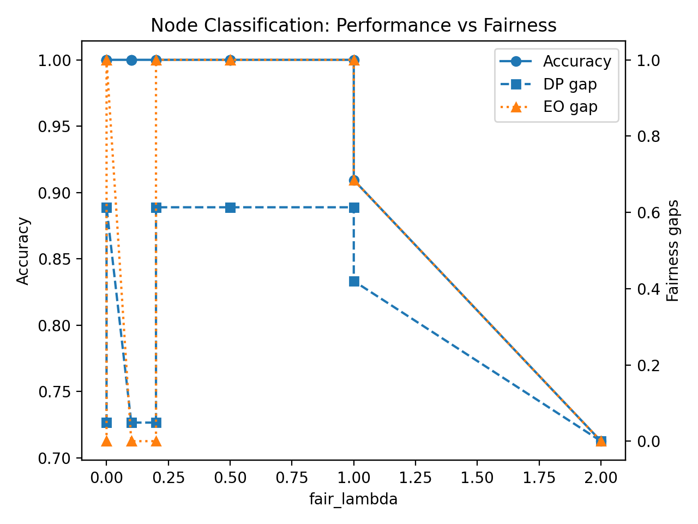
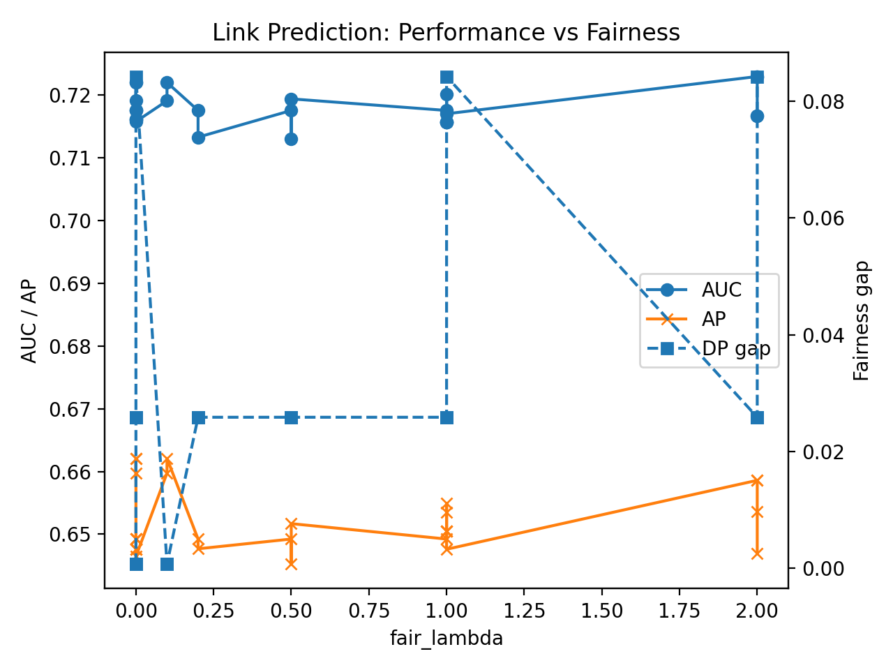

# Fairness–Utility Trade-offs in Graph Learning
Status: v1.1.0 released (reproducible)

This repository provides a small, reproducible scaffold for studying utility–fairness trade-offs in graph learning.

**Quick links:** [Release v1.1.0](https://github.com/LexAI-Fan/Fan-lex-ai_Fairness_Utility_GraphLearning/releases/tag/v1.1.0) · [Pilot (N=6)](docs/pilot_hci_study.md) · [Reproduce](scripts/run_sweep.ps1)


Default experiments use a synthetic **LocalSBM** graph and log configuration + metrics as **one JSON artifact per run** under `results/`.

## Description (3 lines)

- **What:** Reproducible LocalSBM graph experiments (node classification + link prediction) with a fairness regularizer (`--fair_lambda`) and DP/EO evaluation.
- **How:** Run `python .\src\train_nodeclf.py --epochs 50` and `python .\src\train_linkpred.py --epochs 50`; then `python .\make_figures.py`.
- **Outputs:** Per-run JSON artifacts in `results/`, curated example artifacts in `docs/example_*.json`, and trade-off plots in `docs/figures/`.

## What’s included

- Node classification and link prediction experiments
- Simple fairness metrics: **DP** (Demographic Parity), **EO** (Equalized Odds)
- A controllable fairness regularization knob: `--fair_lambda`
- Reproducible run artifacts: JSON logs saved under `results/`

**Design goal:** reproducibility and auditability — **one command → one JSON artifact** (config + metrics).

## Repository layout

- `src/`
  - `data.py`: data loading / synthetic graph generation
  - `models.py`: GNN models
  - `fairness.py`: DP/EO metrics and (optional) penalty term
  - `utils.py`: seeds, logging, helpers
  - `train_nodeclf.py`: node classification training and evaluation
  - `train_linkpred.py`: link prediction training and evaluation
- `results/`  
  - experiment outputs (JSON artifacts; typically not committed)
- `make_figures.py`  
  - figure generation from saved JSON artifacts
- `docs/`
  - `figures/` and small example artifacts for review
## Figures

**Node classification (utility vs fairness)**  


**Link prediction (utility vs fairness)**  


**Pilot study results (N=6):** [docs/pilot_hci_study.md](docs/pilot_hci_study.md)


## Environment setup (Windows PowerShell)

From the repository root:

```powershell
python -m venv .venv
.\.venv\Scripts\Activate.ps1
python -m pip install -U pip
pip install -r .\requirements.txt
